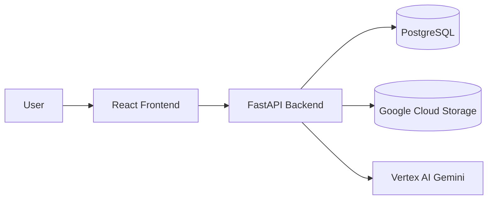
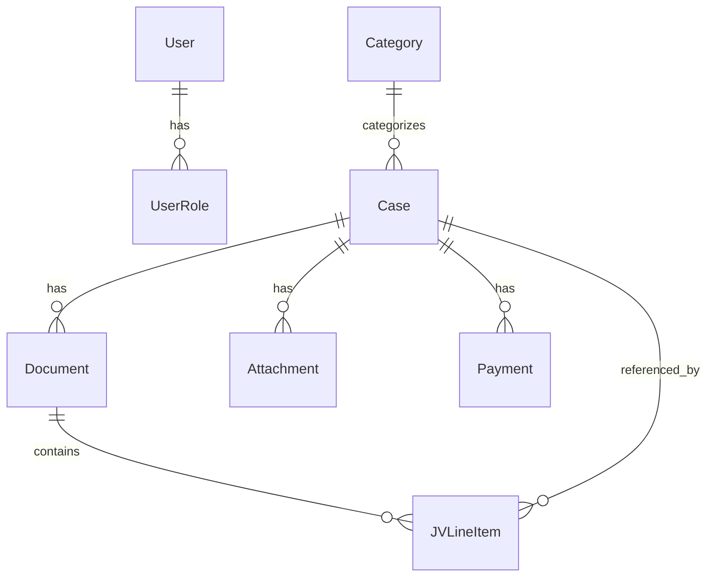
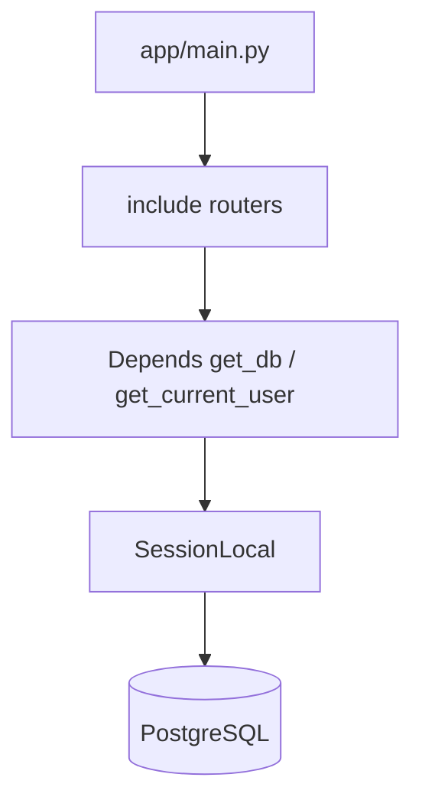
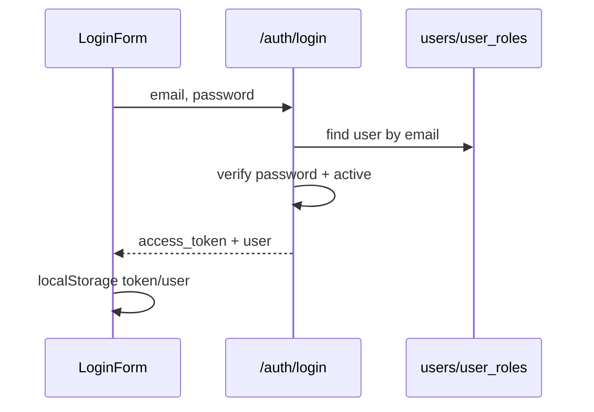
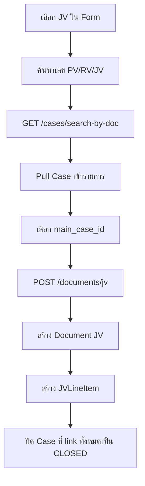
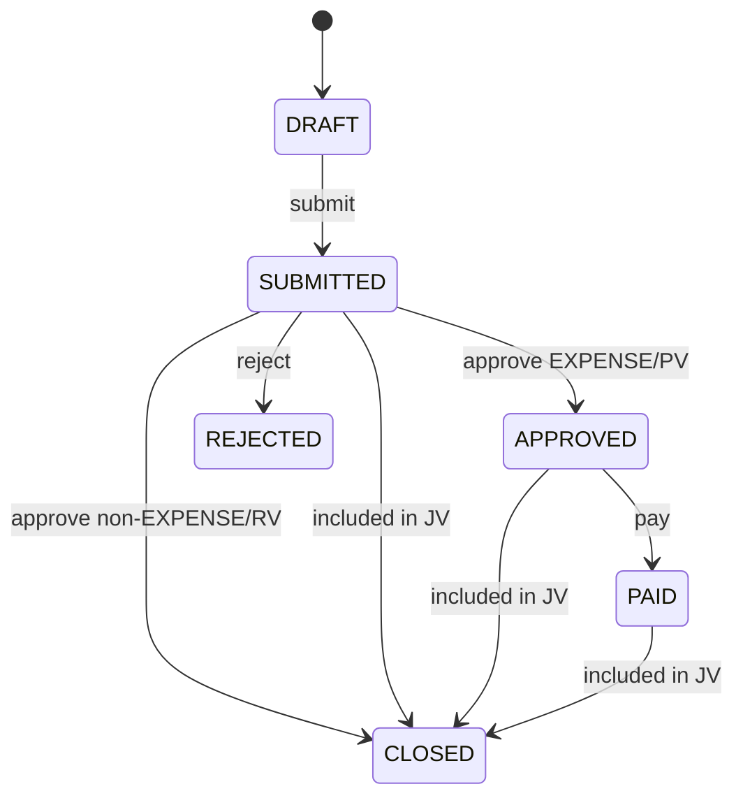
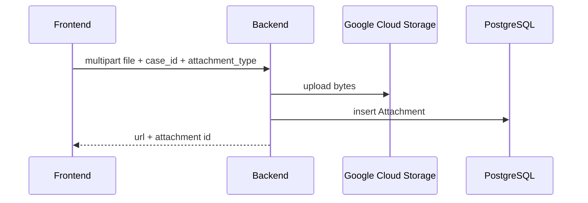

# ProjectPRT Flow

เอกสารนี้สรุป flow การทำงานของโปรเจกต์ ProjectPRT จากโค้ดปัจจุบันใน `ProjectPRT-BE` และ `ProjectPRT-FE` ณ วันที่ 2026-05-21 โดยยึด implementation จริงเป็นหลัก

> หมายเหตุ: โปรเจกต์มี spec เก่าที่พูดถึง `PS/CR/DB` แต่โค้ดปัจจุบัน refactor มาเป็น voucher system แบบ `PV/RV/JV` แล้ว ดังนั้นเอกสารนี้จะอธิบาย `PV/RV/JV` เป็นหลัก

## 1. ภาพรวมระบบ

ProjectPRT เป็นระบบบัญชีและจัดการเอกสารการเงิน มีแกนหลักคือ `Case` 1 รายการ แล้วสร้าง voucher และไฟล์แนบตาม workflow



ส่วนหลักของโปรเจกต์:

| ส่วน | Path | หน้าที่ |
| --- | --- | --- |
| Frontend | `ProjectPRT-FE` | React/Vite UI, form, dashboard, approval, reports |
| Backend | `ProjectPRT-BE` | FastAPI API, business workflow, auth, database, GCS, AI chat |
| Database migration | `ProjectPRT-BE/alembic` | PostgreSQL schema และ schema evolution |
| Business docs | `business_logic.md`, `ProjectPRT-BE/specs` | เอกสาร business rule และ spec เดิม |

## 2. Core Domain Model

ตารางหลักอยู่ใน `ProjectPRT-BE/app/models.py`

| Model | ความหมาย |
| --- | --- |
| `User`, `UserRole` | ผู้ใช้และ role |
| `Category` | หมวดบัญชี, account code, type `EXPENSE`, `REVENUE`, `ASSET` |
| `Case` | รายการธุรกรรมหลักของระบบ |
| `Document` | Voucher ที่ผูกกับ Case เช่น `PV`, `RV`, `JV` |
| `JVLineItem` | link JV กลับไปหา Case หลายใบ |
| `Attachment` | ไฟล์แนบ เช่น PS, receipt, quote |
| `Payment` | ตารางรองรับ payment แต่ flow ปัจจุบันยังไม่ได้สร้าง row ตอน mark paid |
| `AuditLog` | ประวัติ action สำคัญ |
| `DocCounter` | ตัวนับเลขเอกสารแยกตามประเภทและเดือน |
| `TransactionV1` | legacy transaction สำหรับ flow เก่า |

ความสัมพันธ์หลัก:



## 3. Runtime Startup Flow

### Backend

Entry point หลักคือ `ProjectPRT-BE/app/main.py`

1. สร้าง FastAPI app
2. ตั้งค่า CORS จาก `app.core.settings.settings.CORS_ALLOW_ORIGINS`
3. include routers:
   - `/api/v1/auth`
   - `/api/v1/admin`
   - `/api/v1/categories`
   - `/api/v1/cases`
   - `/api/v1/files`
   - `/api/v1/documents`
   - `/api/v1/dashboard`
   - `/api/v1/transactions`
   - `/api/v1/insights`
   - `/api/v1/profit-loss`
   - `/api/v1/chat`
4. เปิด health check ที่ `/healthz`

Database session มาจาก `ProjectPRT-BE/app/db.py`



### Frontend

Entry point คือ `ProjectPRT-FE/index.tsx` แล้ว render `App.tsx`

`App.tsx` ทำงานหลัก:

1. ตรวจ token ใน `localStorage` ผ่าน `hasValidAuthSession`
2. ถ้ายังไม่ login แสดง `LoginForm` หรือ `SignUpForm`
3. ถ้า login แล้วโหลด role ล่าสุดจาก `GET /api/v1/auth/me`
4. ถ้า URL มี `?documentPreview=...` แสดง `DocumentPreviewPage` เฉพาะ non-requester-limited user
5. ถ้า login แล้วแสดง layout หลักพร้อม `Sidebar`
6. เปลี่ยนหน้าโดย `ViewType`

เมนูหลักใน `Sidebar.tsx`:

| View | Component |
| --- | --- |
| Dashboard | `Dashboard.tsx` |
| Form | `Form.tsx` |
| Insights | `Insights.tsx` |
| Profit and loss | `ProfitLoss.tsx` |
| Chat View | `ChatView.tsx` |
| Approvals | `AdminApproval.tsx` |
| Document Manager | `DocumentManager.tsx` |
| User Management | `UserManager.tsx` |

Requester-only user (`roles=["requester"]`) ถูกจำกัด frontend ไว้เฉพาะ:

- `Form`
- `Document Manager`

## 4. Auth และ Role Flow

### Login ด้วย email/password

Frontend:

1. `LoginForm.tsx` ส่ง `POST /api/v1/auth/login`
2. ถ้าสำเร็จ เก็บ `token` และ `user` ใน `localStorage`
3. `api.ts` axios interceptor ใส่ `Authorization: Bearer <token>` ทุก request
4. ถ้า token หมดอายุ จะ clear session และ dispatch event `auth:session-expired`

Backend:

1. `auth.py` หา user จาก email
2. ตรวจ password ด้วย `Hasher.verify_password`
3. ตรวจ `is_active`
4. สร้าง JWT ด้วย `create_access_token`
5. endpoint อื่นอ่าน JWT ผ่าน `deps.get_current_user` หรือ `rbac.require_roles`



### Signup

1. `SignUpForm.tsx` ส่ง `POST /api/v1/auth/signup`
2. Backend สร้าง user ใหม่, hash password, assign role `requester`
3. Backend ตั้ง `is_approved=false`
4. Frontend แสดงสถานะรออนุมัติ
5. `admin` หรือ `approver` อนุมัติผ่านหน้า User Management
6. หลังอนุมัติ user จึง login ได้

### Role ที่ใช้ในระบบ

Role หลัก:

- `requester`
- `approver`
- `finance`
- `accounting`
- `treasury`
- `admin`
- `executive`
- `viewer`

`approver` เป็น role สูงสุดและ inherit สิทธิ์ของ `admin` ทั้งหมด แต่ตัว role `approver` เองเป็น system-managed role สำหรับผู้อนุมัติ 1-2 คนต่อองค์กร และไม่ควรถูกเพิ่ม/ลบผ่านหน้า User Management ปกติ

`requester` ใช้งานได้เฉพาะหน้า `Form` และ `Document Manager`; backend อนุญาตเฉพาะ API ที่จำเป็นสำหรับสร้าง/submit case, upload/list attachment, อ่าน category และค้นหา/list case ของตัวเอง

มีการเช็ค role 2 style:

| Style | File | ใช้กับ |
| --- | --- | --- |
| FastAPI dependency | `app/deps.py` | cases, files, categories, chat |
| request helper | `app/rbac.py` | dashboard, documents, admin, transactions |

## 5. Master Data Flow: Category

Category เป็น master data สำหรับเลือกหมวดบัญชีและ account code

Frontend:

- `Form.tsx` เรียก `getCategories(type)`
- PV ใช้ `EXPENSE`
- RV ใช้ `REVENUE`
- Bank/deposit account ใช้ `ASSET`

Backend:

- `GET /api/v1/categories/`
- `GET /api/v1/categories/revenue-income-types`
- `POST /api/v1/categories/`
- `PATCH /api/v1/categories/{category_id}`

Business rule:

1. Category ต้อง active จึงใช้สร้าง Case ได้
2. `name_th` ห้ามซ้ำ
3. `account_code` ห้ามซ้ำ
4. สร้าง/แก้ไขได้เฉพาะ `accounting` หรือ `admin`
5. ตอนสร้าง Case จะ copy `category.account_code` ไปเก็บใน `cases.account_code`

## 6. Main Workflow: PV รายจ่าย

PV คือ Payment Voucher สำหรับรายจ่าย โดยเริ่มจากหน้า `Form`

```mermaid
flowchart TD
    A[Requester เปิด Form] --> B[เลือก PV]
    B --> C[โหลด EXPENSE categories]
    C --> D[กรอก item และ purpose]
    D --> E[อัปโหลดใบ PS]
    E --> F[POST /cases สร้าง Case DRAFT]
    F --> G[POST /cases/{id}/upload-receipt type=PS]
    G --> H[POST /cases/{id}/submit]
    H --> I[สร้าง Document PV และเลข PV-YYMM-####]
    I --> J[Case = SUBMITTED]
    J --> K[Finance/Admin/Accounting เปิด Approvals]
    K --> L[Approve หรือ Reject]
    L --> M[Approve: stamp PDF, Case = APPROVED]
    L --> N[Reject: Case = REJECTED]
    M --> O[Treasury/Admin mark paid]
    O --> P[Case = PAID]
    P --> Q[Upload receipt]
    Q --> R[is_receipt_uploaded = true]
```

### Step-by-step

1. `Form.tsx` เลือกเอกสาร `pv`
2. Frontend โหลด category type `EXPENSE`
3. User กรอก item lines
4. Frontend คำนวณยอด:
   - PV ใช้ `quantity * price`
   - total ต้องมากกว่า 0
5. PV ต้องเลือกไฟล์ PS ก่อน submit
6. Frontend เรียก `createCase`
   - `POST /api/v1/cases/`
   - status เริ่มเป็น `DRAFT`
7. Frontend upload PS:
   - `POST /api/v1/cases/{case_id}/upload-receipt`
   - `attachment_type=PS`
8. Frontend submit case:
   - `POST /api/v1/cases/{case_id}/submit`
9. Backend สร้าง `Document`:
   - `doc_type=PV`
   - `doc_no=PV-YYMM-####`
   - `pdf_uri=pending-approval`
10. Case เปลี่ยนเป็น `SUBMITTED`
11. `AdminApproval.tsx` โหลด `GET /api/v1/cases/?status=SUBMITTED`
12. ผู้มี role `approver` กด approve:
   - `POST /api/v1/cases/{case_id}/approve`
13. Backend ตรวจว่า:
   - Case ต้อง `SUBMITTED`
   - มี Document แล้ว
   - ผู้อนุมัติมี display name
   - มี attachment type `PS`
   - PS ต้องเป็น PDF
14. Backend download PS จาก GCS แล้ว stamp approval text ลง PDF
15. Backend upload approved PDF กลับ GCS
16. `Document.pdf_uri` ถูกอัปเดตเป็น approved PDF URI
17. Case รายจ่ายเปลี่ยนเป็น `APPROVED`
18. Treasury/Admin mark paid:
   - `POST /api/v1/cases/{case_id}/pay`
   - status เปลี่ยนเป็น `PAID`
19. `DocumentManager.tsx` ใช้ตามใบเสร็จที่ยังขาด
20. Upload receipt แล้ว `is_receipt_uploaded=true`

ไฟล์หลัก:

- Frontend: `ProjectPRT-FE/src/components/Form.tsx`
- Frontend approval: `ProjectPRT-FE/src/components/AdminApproval.tsx`
- Backend: `ProjectPRT-BE/app/routers/cases.py`
- Doc number: `ProjectPRT-BE/app/services/doc_numbers.py`
- PDF stamp: `ProjectPRT-BE/app/services/pdf.py`
- GCS: `ProjectPRT-BE/app/services/gcs.py`

## 7. Main Workflow: RV รายรับ

RV คือ Receive Voucher สำหรับรายรับหรือเงินคืน

```mermaid
flowchart TD
    A[Requester เปิด Form] --> B[เลือก RV]
    B --> C[โหลด REVENUE categories]
    B --> D[โหลด ASSET bank accounts]
    C --> E[เลือกประเภทรายได้]
    D --> F[เลือกบัญชีรับเงิน]
    E --> G[POST /cases สร้าง DRAFT]
    F --> G
    G --> H[POST /cases/{id}/submit]
    H --> I[สร้าง Document RV]
    I --> J[Case = SUBMITTED]
    J --> K[Approve]
    K --> L[Case = CLOSED]
```

Step หลัก:

1. `Form.tsx` เลือกเอกสาร `rv`
2. Frontend โหลด category type `REVENUE`
3. Frontend โหลด bank accounts จาก category type `ASSET`
4. ต้องส่ง `deposit_account_id`
5. Frontend เรียก `POST /api/v1/cases/`
6. Backend สร้าง Case `DRAFT`
7. Frontend เรียก `POST /api/v1/cases/{case_id}/submit`
8. Backend map category `REVENUE` เป็น `DocumentType.RV`
9. สร้างเลข `RV-YYMM-####`
10. Case เป็น `SUBMITTED`
11. Approve แล้ว backend ตั้ง status เป็น `CLOSED` สำหรับ non-expense

## 8. Main Workflow: JV ปรับปรุงบัญชี

JV คือ Journal Voucher สำหรับรวมหลาย Case หรือปิด/ปรับปรุงรายการ



Step หลัก:

1. `Form.tsx` เลือกเอกสาร `jv`
2. User ค้นหาเอกสารเดิมด้วยเลขเอกสาร
3. Frontend เรียก `GET /api/v1/cases/search-by-doc?doc_no=...`
4. User pull รายการเข้า form
5. User เลือก `main_case_id`
6. Frontend เรียก `POST /api/v1/documents/jv`
7. Backend:
   - ตรวจ main case
   - เช็คว่า main case ยังไม่มี JV
   - รวมยอดจาก `Case.requested_amount`
   - generate เลข `JV-YYMM-####`
   - สร้าง `Document(doc_type=JV)`
   - สร้าง `JVLineItem` ให้ทุก Case
   - set ทุก Case ที่ถูก link เป็น `CLOSED`

ไฟล์หลัก:

- Frontend: `ProjectPRT-FE/src/components/Form.tsx`
- Backend: `ProjectPRT-BE/app/routers/documents.py`

## 9. Case State Machine ปัจจุบัน

สถานะที่ implement ใน `CaseStatus`:

| Status | ความหมาย |
| --- | --- |
| `DRAFT` | สร้าง Case แล้ว แต่ยังไม่ submit |
| `SUBMITTED` | ส่งเข้า approval แล้ว และมีเลข voucher แล้ว |
| `APPROVED` | อนุมัติแล้ว สำหรับ expense/PV |
| `REJECTED` | ถูกปฏิเสธ |
| `PAID` | Treasury/Admin mark paid แล้ว |
| `CLOSED` | ปิดรายการแล้ว หรือ RV/non-expense อนุมัติแล้ว |
| `CANCELLED` | ยกเลิก |

Transition ที่เห็นในโค้ด:



## 10. File และ GCS Flow

ไฟล์แนบเก็บ metadata ใน `attachments` และ binary file อยู่ใน Google Cloud Storage

Upload flow:



Endpoint หลัก:

- `POST /api/v1/cases/{case_id}/upload-receipt`
- `POST /api/v1/files/upload`
- `GET /api/v1/files/{case_id}/list`

Attachment type:

- `QUOTE`
- `RECEIPT`
- `PS`
- `SIGNATURE`
- `OTHER`

การ preview:

1. Dashboard, Insights, Approval หรือ Document Manager ขอ file list
2. Backend generate signed/download URL
3. Frontend เรียก `openDocumentPreview`
4. Payload ถูกเก็บใน `localStorage` ด้วย key `prt_document_preview:<uuid>`
5. เปิด tab ใหม่ด้วย `?documentPreview=<uuid>`
6. `DocumentPreviewPage` แสดง PDF/image ผ่าน `AttachmentPreviewContent`

## 11. Dashboard Flow

Frontend ปัจจุบันใช้ `getDashboardData(year)` ใน `api.ts`

```ts
GET /api/v1/documents?year=YYYY
```

Backend endpoint นี้อยู่ใน `ProjectPRT-BE/app/routers/documents.py`

ข้อมูลที่คำนวณ:

| ส่วน | Logic |
| --- | --- |
| income | sum `Document.amount` ที่ `doc_type=RV` |
| expenses | sum `Document.amount` ที่ `doc_type=PV` |
| balance | income - expenses |
| monthlyStats | รายจ่าย PV แยกเดือน |
| activityStats | รายจ่าย PV group by category |
| latestTransactions | เอกสารล่าสุด 5 รายการ |

Filter สำคัญ:

- กรองตามปีของ `Document.created_at`
- ตัด status `DRAFT`, `CANCELLED`, `REJECTED`, `SUBMITTED`
- ใช้ role `admin`, `accounting`, `viewer`, `approver`

มีอีก endpoint คือ `GET /api/v1/dashboard?year=YYYY` ใน `dashboard.py` แต่ frontend ปัจจุบันไม่ได้เรียก endpoint นี้ใน `Dashboard.tsx`

## 12. Approval Flow

หน้า `AdminApproval.tsx`:

1. โหลด Case ที่รออนุมัติด้วย `GET /api/v1/cases/?status=SUBMITTED`
2. แสดง PS หรือ approved PDF preview
3. กด approve แล้วเรียก `POST /api/v1/cases/{case_id}/approve`
4. กด reject แล้วเรียก `POST /api/v1/cases/{case_id}/reject`
5. หลัง approve ถ้ามี `approved_pdf_url` จะเปิด preview ได้

Backend approve:

1. ตรวจ role `approver`
2. ตรวจ status `SUBMITTED`
3. หา Document ของ Case
4. หา PS attachment ล่าสุด
5. ตรวจ content type ต้องเป็น PDF
6. download PS PDF จาก GCS
7. stamp ข้อความอนุมัติ
8. upload approved PDF
9. update Case และ Document
10. log audit action `approve`

Reject:

1. ตรวจ status `SUBMITTED`
2. ต้องมี note
3. set status `REJECTED`
4. เก็บ `reject_reason` และ `rejected_at`
5. log audit action `reject`

## 13. Document Manager Flow

หน้า `DocumentManager.tsx` ใช้ตามเอกสารที่ยังขาด receipt

Default:

- `showMissingOnly=true`
- เรียก `GET /api/v1/cases/paged?missing_only=true`

Search:

- เรียก `GET /api/v1/cases/search-by-doc-paged?doc_no=...`

Upload:

- เลือก Case ในตาราง
- กด upload
- เรียก `POST /api/v1/cases/{case_id}/upload-receipt`
- default `attachmentType=RECEIPT`
- Backend set `Case.is_receipt_uploaded=true`
- reload list แล้วรายการจะหายจาก missing-only view

## 14. Insights Flow

หน้า `Insights.tsx`:

1. โหลด users ด้วย `GET /api/v1/admin/users`
2. โหลด categories ด้วย `GET /api/v1/categories/`
3. เมื่อ filter เปลี่ยน เรียก:

```ts
GET /api/v1/insights/?user_id=...&month=...&year=...&category_id=...
```

Backend `insights.py`:

- ใช้ `Case.created_at` filter เดือน/ปี
- filter requester/category/category_type ได้
- นับเฉพาะ status `DRAFT`, `SUBMITTED`, `APPROVED`, `PAID`, `CLOSED`
- pending คือ `SUBMITTED`
- approved คือ `APPROVED`, `PAID`, `CLOSED`
- ใช้ยอดจาก `Case.requested_amount`
- แสดง doc_no จาก documents ที่ผูกกับ Case

## 15. Profit and Loss Flow

หน้า `ProfitLoss.tsx` มี 2 mode:

| Mode | Flow |
| --- | --- |
| Official Template | เรียก backend แล้ว merge เข้ากับ template |
| Excel Mode | import `.xlsx` หรือ `.xls` แล้ว parse ใน frontend |

Backend:

```ts
GET /api/v1/profit-loss?year=2565
GET /api/v1/profit-loss/revenue-income-types?year=2565
```

Logic:

1. `year` เป็นปี พ.ศ.
2. Fiscal year: 1 ต.ค. ของปีก่อนหน้า ถึงก่อน 1 ต.ค. ของปีที่เลือก
3. ใช้ Case status `APPROVED` หรือ `CLOSED`
4. ใช้ Category type `EXPENSE` และ `REVENUE`
5. group by `Category.account_code`
6. ยอดเงินใช้ `Case.requested_amount`
7. map เข้า template `งบดำเนินการ`, `งบนอก`, `งบอุดหนุน`

## 16. Chat / AI Assistant Flow

หน้า `ChatView.tsx` ส่งข้อความไป backend:

```ts
POST /api/v1/chat
```

Backend:

1. ต้อง login ผ่าน `deps.get_current_user`
2. `chat.py` เรียก `PRTChatAgent`
3. `PRTChatAgent` ใช้ Vertex AI Gemini model `gemini-2.5-flash`
4. Agent มี tool สำหรับ query database
5. AI ตอบภาษาไทย

Tools ใน `chat_tools.py`:

- ค้นหาเอกสารจากเลขเอกสาร
- สรุปรายรับ/รายจ่าย
- เช็ค workflow status
- ตอบ policy mock
- เทียบยอดเดือนนี้กับเดือนก่อน

Rule สำคัญ:

- การคำนวณ spending/expense/income ไม่รวม JV เว้นแต่ user ถามถึง JV โดยตรง
- Chat เป็น assistant เท่านั้น ไม่ใช่ source of truth

## 17. User Management Flow

หน้า `UserManager.tsx` ใช้สำหรับ `admin` และ `approver`

Frontend endpoint:

- `GET /api/v1/admin/users`
- `PATCH /api/v1/admin/users/{user_id}`
- `POST /api/v1/admin/users/{user_id}/approve`
- `POST /api/v1/admin/users/{user_id}/roles`
- `DELETE /api/v1/admin/users/{user_id}`

Backend `admin.py`:

1. ทุก endpoint ใช้ `require_roles(..., [admin])`; `approver` ผ่านได้เพราะ inherit สิทธิ์ `admin`
2. List users แสดงเฉพาะ `is_active=true` รวมถึง user ที่ `is_approved=false`
3. Approve user ตั้ง `is_approved=true`
4. Update user แก้ `name`, `position`
5. Update roles ลบ role เดิมทั้งหมดแล้ว insert ใหม่ ยกเว้น system-managed role เช่น `approver`
6. Delete คือ soft delete โดย set `is_active=false`

## 18. Build และ Deploy Flow

### Backend deploy

ไฟล์หลัก:

- `ProjectPRT-BE/Dockerfile`
- `ProjectPRT-BE/deploy.sh`

Flow:

1. Docker image ใช้ `python:3.10-slim`
2. ติดตั้ง system dependencies เช่น `libpq-dev` และ `fonts-thai-tlwg`
3. ติดตั้ง Python packages จาก `requirements.txt`
4. copy backend source เข้า image
5. run ด้วย `gunicorn` + `uvicorn.workers.UvicornWorker`
6. deploy script build image ด้วย Cloud Build
7. push image ไป Artifact Registry
8. deploy Cloud Run พร้อม Cloud SQL instance และ env vars

### Frontend deploy

ไฟล์หลัก:

- `ProjectPRT-FE/Dockerfile`
- `ProjectPRT-FE/deploy.sh`
- `ProjectPRT-FE/nginx.conf`
- `ProjectPRT-FE/vite.config.ts`

Flow:

1. Docker stage แรกใช้ `node:20-alpine`
2. run `npm install`
3. build React app ด้วย `npm run build`
4. Docker stage ที่สองใช้ `nginx:alpine`
5. copy `dist` ไป `/usr/share/nginx/html`
6. `nginx.conf` serve SPA และ proxy `/api/` ไป backend Cloud Run
7. deploy script build image ด้วย Cloud Build แล้ว deploy Cloud Run

Local dev:

- Frontend Vite ใช้ port `3000`
- `vite.config.ts` proxy `/api/v1` ไป backend Cloud Run ถ้าไม่ได้ตั้ง `VITE_API_URL`
- Backend local ต้องมี `.env` ที่มี `DATABASE_URL`, `SECRET_KEY`, GCS config และ Google config ตาม `app/core/settings.py`

## 19. Legacy และ Helper Files

ไฟล์บางส่วนเป็น legacy หรือ helper ไม่ใช่ flow หลักปัจจุบัน:

| File | สถานะ/หน้าที่ |
| --- | --- |
| `ProjectPRT-FE/test.tsx` | form flow เก่า ยังอ้าง withdrawal/return/purchase |
| `ProjectPRT-FE/src/services/documentService.ts` | mock document number/save service เก่า |
| `ProjectPRT-BE/docs/api-contract.yaml` | contract phase เก่า ไม่ครอบคลุม API ปัจจุบันทั้งหมด |
| `ProjectPRT-BE/test_phase5.py` | app skeleton/test style เก่า |
| `ProjectPRT-BE/seed_categories_full.py` | seed category master data |
| `ProjectPRT-BE/seed_cloud.py` | seed cloud/admin user helper |
| `ProjectPRT-BE/seed_opening_balances.py` | seed legacy opening balances ลง `transactions_v1` |
| `ProjectPRT-BE/cleanup_legacy_data.py` | cleanup helper |

## 20. API Map แบบสั้น

| Feature | Endpoint |
| --- | --- |
| Signup | `POST /api/v1/auth/signup` |
| Login | `POST /api/v1/auth/login` |
| Google SSO | `POST /api/v1/auth/google` |
| Current user | `GET /api/v1/auth/me`, `GET /api/v1/me` |
| Categories | `GET/POST/PATCH /api/v1/categories` |
| Create case | `POST /api/v1/cases/` |
| Submit case | `POST /api/v1/cases/{case_id}/submit` |
| Approve case | `POST /api/v1/cases/{case_id}/approve` |
| Reject case | `POST /api/v1/cases/{case_id}/reject` |
| Mark paid | `POST /api/v1/cases/{case_id}/pay` |
| Case list | `GET /api/v1/cases/`, `GET /api/v1/cases/paged` |
| Search by doc no | `GET /api/v1/cases/search-by-doc`, `GET /api/v1/cases/search-by-doc-paged` |
| Upload file | `POST /api/v1/cases/{case_id}/upload-receipt`, `POST /api/v1/files/upload` |
| List files | `GET /api/v1/files/{case_id}/list` |
| Dashboard used by FE | `GET /api/v1/documents?year=YYYY` |
| Dashboard alternate | `GET /api/v1/dashboard?year=YYYY` |
| Create JV | `POST /api/v1/documents/jv` |
| Insights | `GET /api/v1/insights/` |
| Profit and loss | `GET /api/v1/profit-loss` |
| Chat | `POST /api/v1/chat` |
| Legacy transaction | `POST /api/v1/transactions` |

## 21. Important File Map

### Backend

| File | หน้าที่ |
| --- | --- |
| `app/main.py` | FastAPI app และ router registration |
| `app/models.py` | SQLAlchemy models และ enums |
| `app/db.py` | database engine/session |
| `app/core/settings.py` | env/config หลัก |
| `app/core/security.py` | JWT create/decode |
| `app/core/hashing.py` | password hash/verify |
| `app/deps.py` | auth dependency และ role dependency |
| `app/rbac.py` | request-based RBAC helper |
| `app/routers/auth.py` | signup/login/google/me |
| `app/routers/admin.py` | user management |
| `app/routers/categories.py` | category master data |
| `app/routers/cases.py` | core case workflow PV/RV |
| `app/routers/documents.py` | dashboard endpoint `/documents` และ JV creation |
| `app/routers/dashboard.py` | alternate dashboard endpoint |
| `app/routers/files.py` | upload/list file |
| `app/routers/insights.py` | insights report |
| `app/routers/profit_loss.py` | P&L report |
| `app/routers/chat.py` | chat endpoint |
| `app/services/doc_numbers.py` | generate voucher number |
| `app/services/gcs.py` | upload/download/signed URL |
| `app/services/pdf.py` | PDF generation/stamping |
| `app/services/audit.py` | audit log insert |
| `app/services/chat_agent.py` | Vertex AI agent |
| `app/services/chat_tools.py` | AI database tools |

### Frontend

| File | หน้าที่ |
| --- | --- |
| `App.tsx` | auth gate, view routing, theme |
| `types.ts` | frontend shared types |
| `src/services/api.ts` | axios client และ API functions |
| `src/services/auth.ts` | token/session helper |
| `src/components/LoginForm.tsx` | login UI |
| `src/components/SignUpForm.tsx` | signup UI |
| `src/components/Sidebar.tsx` | main menu |
| `src/components/Form.tsx` | PV/RV/JV creation flow |
| `src/components/AdminApproval.tsx` | approve/reject flow |
| `src/components/DocumentManager.tsx` | missing receipt tracking |
| `src/components/Dashboard.tsx` | summary/chart/latest transaction |
| `src/components/Insights.tsx` | filterable transaction insight |
| `src/components/ProfitLoss.tsx` | P&L report and Excel import |
| `src/components/ChatView.tsx` | AI chat UI |
| `src/components/DocumentPreviewPage.tsx` | file preview page |
| `src/utils/documentPreview.ts` | open preview tab |

## 22. Data Source ของแต่ละ Report

| Report/View | Source หลัก | หมายเหตุ |
| --- | --- | --- |
| Dashboard `/documents` | `Document.amount` | PV/RV, ไม่รวม draft/submitted/rejected/cancelled |
| Dashboard `/dashboard` | `Document.amount` | ใช้เฉพาะ `Case.status=APPROVED` |
| Insights | `Case.requested_amount` | filter จาก `Case.created_at` |
| Profit and Loss | `Case.requested_amount` | fiscal year แบบ พ.ศ. |
| Chat analytics | `Document.amount` | ไม่รวม JV |
| Document Manager | `Case.is_receipt_uploaded` | default แสดงรายการ missing receipt |

## 23. จุดที่ควรรู้ก่อนแก้โค้ดต่อ

1. `business_logic.md` เป็นเอกสาร business rule ที่ละเอียดกว่า ส่วน `FLOW.md` นี้เน้น flow ของระบบและแผนที่ไฟล์
2. Spec เก่าบางไฟล์ยังพูดถึง `PS/CR/DB` แต่โค้ดหลักเป็น `PV/RV/JV`
3. `ProjectPRT-BE/app/routers/documents.py` มี endpoint dashboard `/api/v1/documents` และ endpoint create JV อยู่ในไฟล์เดียวกัน
4. Frontend Dashboard เรียก `/api/v1/documents` ไม่ใช่ `/api/v1/dashboard`
5. `/api/v1/documents` กับ `/api/v1/dashboard` ใช้ filter status ไม่เหมือนกัน
6. `POST /api/v1/documents/jv` ยังไม่ได้ enforce auth/role ใน signature ปัจจุบัน
7. `POST /api/v1/cases/{case_id}/pay` เปลี่ยน status เป็น `PAID` แต่ยังไม่ได้สร้าง row ใน `payments`
8. `GET /api/v1/files/{case_id}/list` มี comment ว่ายังควร validate access เพิ่มถ้าต้อง strict
9. Google SSO endpoint สร้าง token โดยใช้ Google subject เป็น `sub` แต่ dependency หลักหา user จาก `User.id`; ควรตรวจ flow นี้ก่อนเปิดใช้จริง
10. `ProjectPRT-FE/test.tsx` ดูเป็น legacy form ตัวเก่า ไม่ใช่ flow หลักที่ `App.tsx` ใช้
11. `ProjectPRT-BE/docs/api-contract.yaml` เป็น contract ของ phase เก่าบางส่วน จึงไม่ครอบคลุม endpoint ปัจจุบันทั้งหมด
12. deploy/seed scripts มีค่า environment เฉพาะเครื่องหรือเฉพาะ cloud project ควรตรวจและย้ายค่าลับไป secret/env ก่อนใช้งานจริง

## 24. Flow สรุปเร็ว

### PV

1. Login
2. Form เลือก PV
3. เลือก EXPENSE category
4. กรอก item
5. Upload PS PDF
6. Create Case `DRAFT`
7. Upload PS attachment
8. Submit แล้วสร้าง `PV-YYMM-####`
9. Case เป็น `SUBMITTED`
10. Approver approve
11. Stamp approved PDF
12. Case เป็น `APPROVED`
13. Treasury/Admin mark paid
14. Case เป็น `PAID`
15. Upload receipt
16. `is_receipt_uploaded=true`

### RV

1. Login
2. Form เลือก RV
3. เลือก REVENUE category
4. เลือก ASSET deposit account
5. Create Case `DRAFT`
6. Submit แล้วสร้าง `RV-YYMM-####`
7. Approve
8. Case เป็น `CLOSED`

### JV

1. Login
2. Form เลือก JV
3. Search เอกสารเดิม
4. Pull Case ที่เกี่ยวข้อง
5. เลือก main case
6. Create JV
7. สร้าง `JV-YYMM-####`
8. สร้าง `JVLineItem`
9. Close ทุก Case ที่ถูก link
